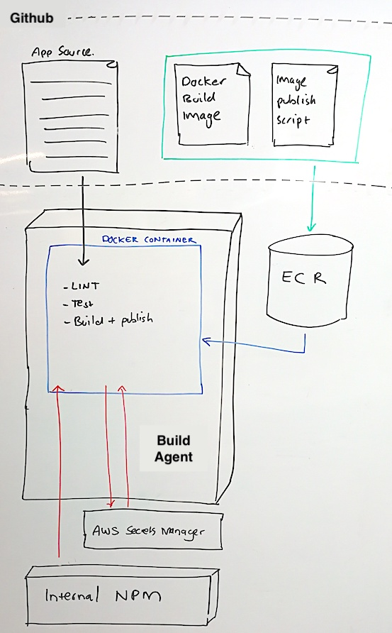

### Delivery of the Web UI

* [How do we use CI?](#how-do-we-use-ci)
* [What do we deploy?](#what-do-we-deploy)
* [Environments](#environments)
* Idealogy
  * [Using ops/bin](#using-opsbin)
  * [Reducing Vendor Lock](#reducing-vendor-lock)
  * [Avoiding 'works on my machine'](#avoiding-works-on-my-machine)
  * [Immutable Infrastructure](#immutable-infrastructure)

---

- The Agent reads (no writes) from Github pulling all app source, including the pipeline configuration and `ops/bin` scripts. 
- Using scripts in `ops/bin` the agent pulls a previously published Build Image from an ECR of the same account, providing an ephemeral environment that grants all required capabilities to the Agent.   
For us this is primarily:  
    - NPM, because Javascript.  
    - An AWS SDK version with Secrets Manager to pull an `.npmrc` file, allowing NPM to read internal MYOB modules. 
  
> :warning: Help! I want to publish a new Build Image.  
> - Add your new required capability to the `Dockerfile.build`.
> - Publish the new image using `./ops/bin/release-build-image`.
> - Subsequent jobs will now use the new container on the agent.

### How do we use CI?

  Buildkite will lint, test and build all Pull Requests on Github.

- All commits to master have an additional deployment step - continuously deploying the Web UI to a 'non prod' s3 bucket.
- A manual push-button process will additionally deploy the Web App to a 'prod' s3 bucket

### What do we deploy?

- The output of our build pipeline is a simple bundle of Javascript and static web assets.

### Environments

- The app is configured to use an **in-memory integration** for pre-prod deployments. This application is backed only by local data, and is largely for visibility of stakeholders outside the team.  
- The app is configured to use a **http integration** for prod deployments, pointing at our BFF.

### Idealogy

#### Using ops/bin

ops/bin is a convention set by Don't Panic. Read more in our [Decisions Wiki]  

ops/bin provides a single interface for how Humans can interact with our software,
providing a set of common practices.
  - Building the App
  - Testing the App
  - Running the App locally
  - etc

#### Reducing Vendor Lock

We treat Buildkite like a Human, a normal member of the team. There is nothing special about CI.  
The only option Buildkite should have to interact with our software is therefor via `ops/bin`, you can see this from our [pipeline.yml](/.buildkite/pipeline.yml)
This provides a thin bash shim of ignorance that allows us to easily lift-and-shift CI vendors.   

#### Avoiding 'works on my machine'

By using the `ops/bin` operations locally you're also guarenteed to run tests
and things in the same environment as the Build Agent.

Developers are still welcome to configure their machines directly for local development, without docker.  
We treat docker as a type of build artefact to target (like a .zip or .jar) rather than a local development tool.

#### Immutable Infrastructure

- We aim to keep all infrastructure immutable. Including our Build agents. 
- We aim to keep the agents stateless. The only state we utalize is the Build Number.
- Developers should feel confident to run, rerun and delete builds or entire pipelines without much drama.

[Decisions Wiki]: https://github.com/MYOB-Technology/sme-web/wiki/Decisions#opsbin
