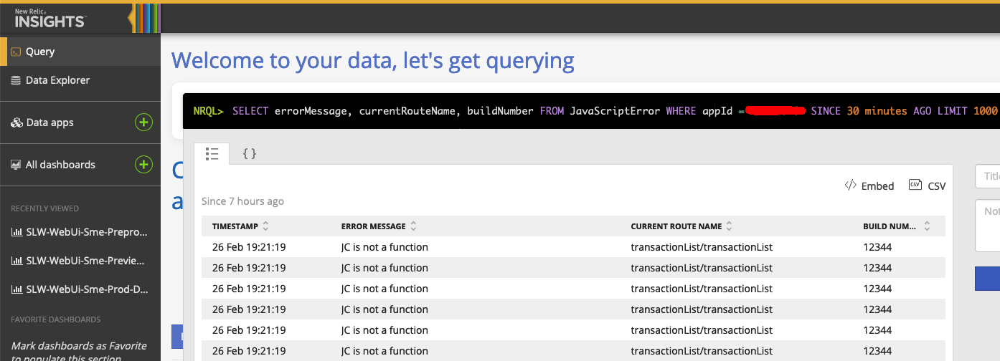

# Finding web errors

We've got newrelic browser monitoring in place which collects JS error information.

There is a limitation in newrelic in that it strips hash fragments from the url when it records JS errors which makes it difficult to figure out which page the error occurred in.

To get around the issue, we manually record the `currentRouteName` as an attribute and send it off to newrelic.

## Querying newrelic

1. Navigate to the `Insights` section of newrelic

2. Run the following NRQL query:

`SELECT errorMessage, currentRouteName FROM JavaScriptError WHERE appId = [appId] SINCE 30 minutes AGO LIMIT 1000`

It will show you a list of JS errors in the past 30 minutes and the pages they occurred in.
Note that `appId` will be the id of the browser app that you're after (we've got 3, `Preprod`, `Preview`, and `Prod`).
