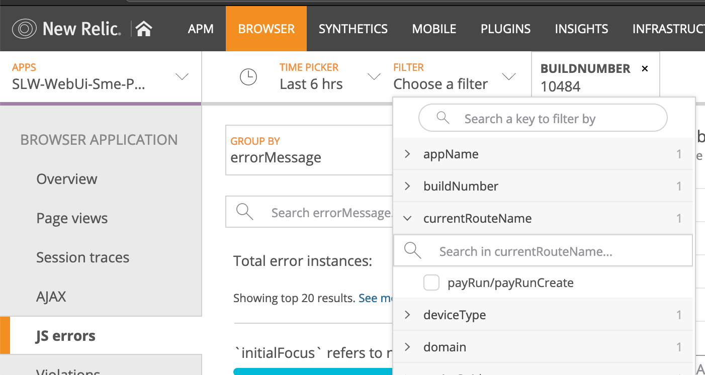
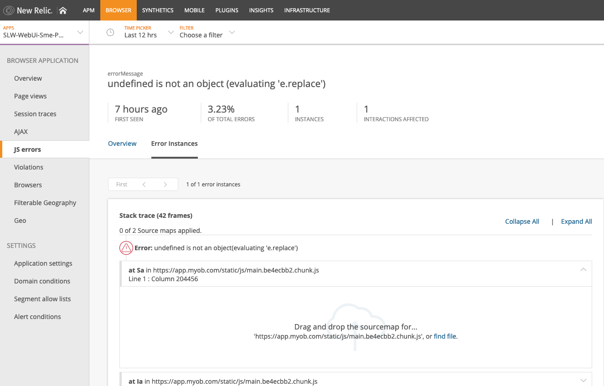
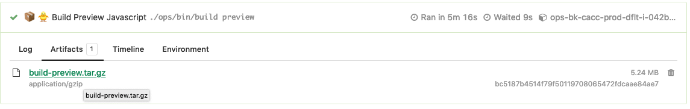

# Finding web errors

We've got newrelic browser monitoring in place which collects JS error information.

There is a limitation in newrelic in that it strips hash fragments from the url when it records JS errors which makes it difficult to figure out which page the error occurred in.

To get around the issue, we manually record the `currentRouteName` as an attribute and send it off to newrelic. Additionally we send the BuildKite `buildNumber` to help identify which version of the application the error occurred in.

## Querying newrelic

1. Navigate to the `Insights` section of newrelic

2. Run the following NRQL query:

`SELECT errorMessage, currentRouteName, buildNumber FROM JavaScriptError WHERE appId = [appId] SINCE 30 minutes AGO LIMIT 1000`

It will show you a list of JS errors in the past 30 minutes and the pages they occurred in.
Note that `appId` will be the id of the browser app that you're after (we've got 3, `Preprod`, `Preview`, and `Prod`).

## JS Errors page

Navigating to the `JS Errors` page will display some information about the errors. You can use the `TIME PICKER` widget to set the time window and can add additional filters (via the `FILTER` widget) such as `currentRouteName` and `buildNumber` to narrow down the error you're looking for.

## Uploading source map files to newrelic

The `JS Errors` page in newrelic allows you to select an instance of an error and upload a `source map` file to show you the stacktrace.

Once you've identified the `buildNumber` of the error instance, you can navigate to that build in BuildKite, click on the `Artifacts` tab and download the build `build-${env}.tar.gz` file.

Uncompress the file via `tar xzf ./build-[environment].tar.gz` which will produce a `build` folder. The source map files will be under `./build/static/js/*.map`. The newrelic UI will display the name of the exact source map file you need to upload. Once you've done that you'll be able to see where in the code the exception occurred.
