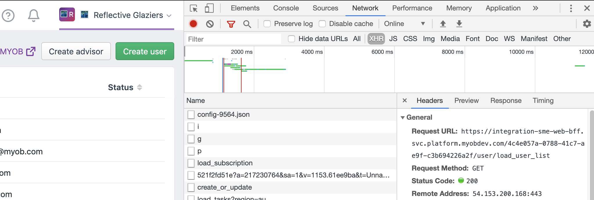
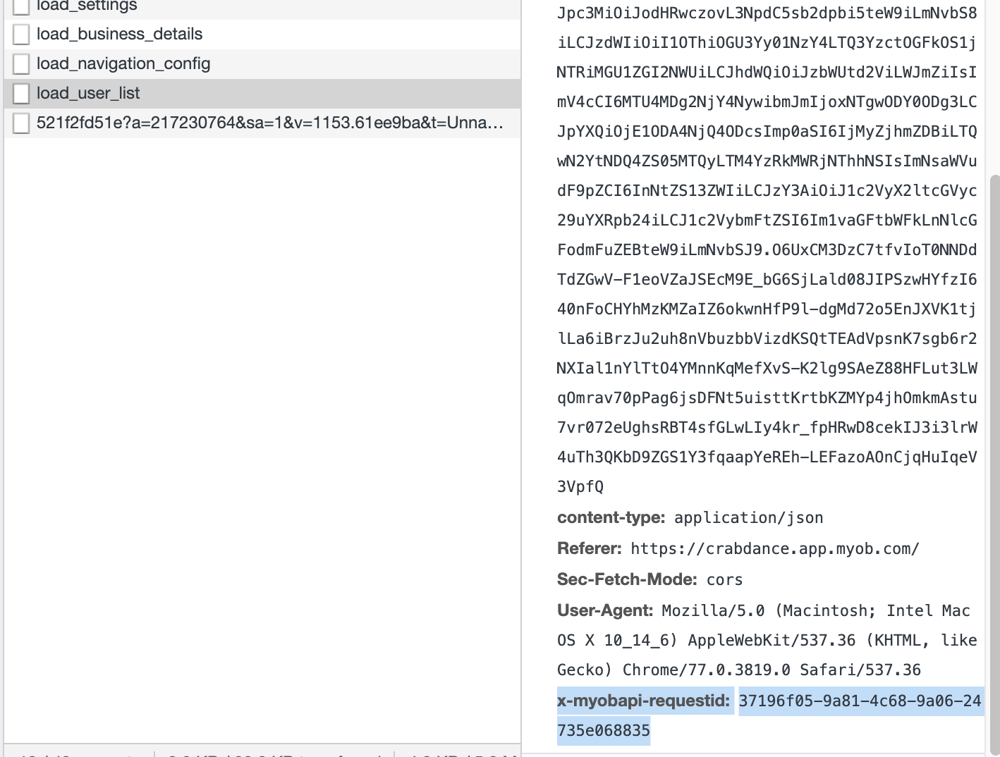

# Getting the Request ID

Each request made by the UI has a [`x-myobapi-requestid` header](../../src/integration/createHttpIntegration.js). This is useful for finding the point of failure and the logs on why it failed.

1. Open `Chrome` devtools and navigate to the `Network` tab 

    
    * Filter by `xhr` requests
1. Do the page action that makes a network request
1. Find the `x-myobapi-requestid` header for that request

    
