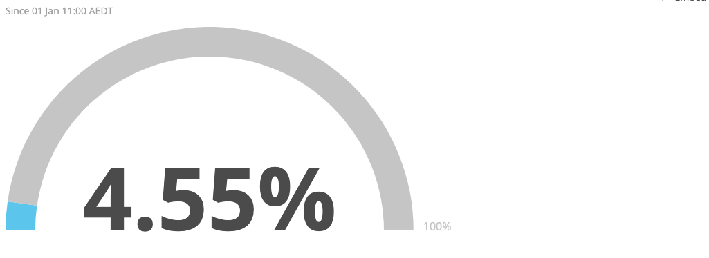
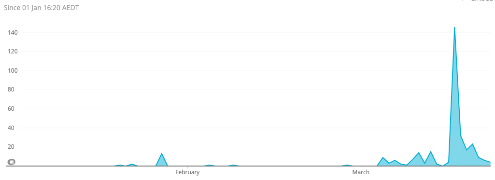
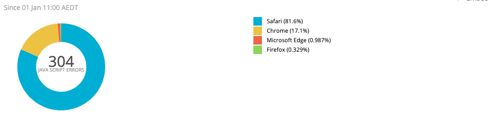

# Known Errors

## Script Error

Findings recorded on `2020-03-23`.

### Status

Silenced from alerts.

`WHERE errorMessage NOT LIKE 'Script error.'` clause added to alert query.

### Stats

It represents about 5% of our errors.

```
SELECT percentage(count(*), WHERE errorMessage LIKE 'Script error.') FROM JavaScriptError SINCE this year
```




It happens around around 5 times a day. There was a spike of [146 errors](https://myob.slack.com/archives/GKEV2PK24/p1584411507027600) on `2020-03-17`.

```
SELECT rate(count(*), 1 day) FROM JavaScriptError WHERE errorMessage LIKE 'Script error.' SINCE this year TIMESERIES 1 day
```



It happens primarily on Safari followed by Chrome with trace occurences in other browsers.

```
SELECT count(*) FROM JavaScriptError WHERE errorMessage LIKE 'Script error.' FACET userAgentName SINCE this year
```



### Description

This error occurs when a JavaScript file required by the page fails to load. Failure to load can be for a [number of reasons](https://stackoverflow.com/questions/5913978/cryptic-script-error-reported-in-javascript-in-chrome-and-firefox)

The nature of the error results in no useful stacktrace.

### Action

For the timebeing, given out limited debugging capability, we are deferring this error until someone reports an occurence and we can reproduce it.
