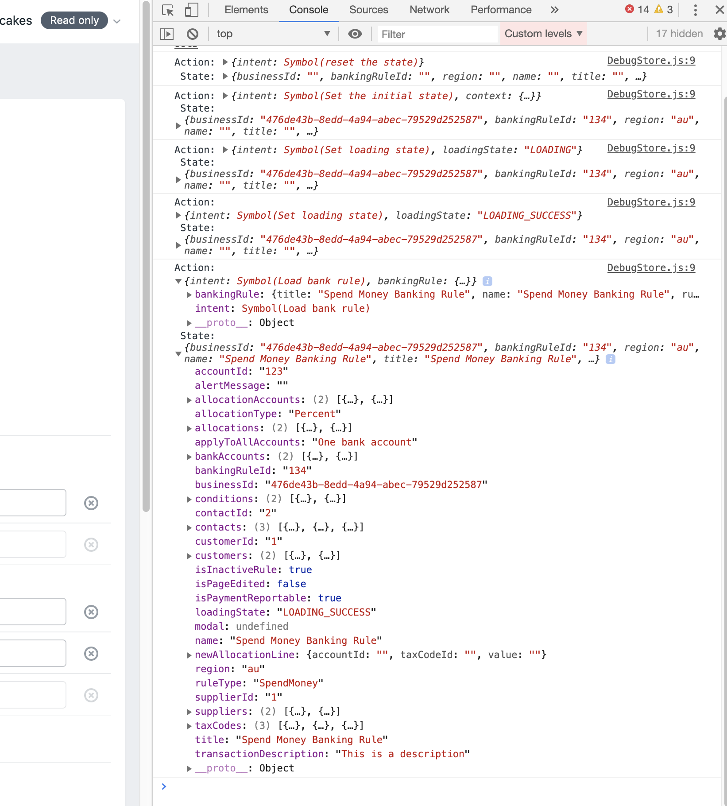

# Local Debugging

We have a few tools to enable local debugging.

## Local Private API Gateway

We can connect the local `sme-web` and `sme-web-bff` stack directly to the `integration` Private API Gateway. This allows us to log the requests and responses we are sending and receiving.

1. Authenticate to the `preprod` cluster

    ```js
    myob-auth k -e europa-preprod
    ```
1. Port forward the integration Private API Gateway to `localhost:5500`

    ```js
    bash -c 'while [ 0 ]; do kubectl port-forward svc/integration-private-api-gateway 5500:80 -n sme; done;'
    ```
1. Generate a `.env.local` in the `sme-web-bff`

    ```sh
    #!/bin/bash

    set -euxo pipefail

    myob-auth k -e europa-preprod

    POD=$(kubectl get pods -l app=sme-web-bff,stack=integration -o name -n sme | head -1)
    POD_ENV=$(kubectl exec -it pod/integration-sme-web-bff-6cbbc6cb94-8pcwt -c sme-web-bff -n sme -- printenv | grep -- "AUTHENTICATION_BFF_CLIENT_SECRET\|STS_BFF_CLIENT_SECRET\|NODE_ENV")

    cat .env.dev > .env.local
    echo $POD_ENV >> .env.local
    ```
1. Duplicate [`allowed-origins.dev.js`](https://github.com/MYOB-Technology/sme-web-bff/blob/master/src/extractor/cors/allowed-origins.dev.js) as `allowed-origins.local.js`
1. Start `sme-web-bff` using the `local` environment

    ```js
    NODE_ENV=local yarn start
    ```
1. Start `sme-web` connected to `sme-web-bff`

    ```js
    REACT_APP_INTEGRATION_TYPE=AuthHttp yarn start
    ```

### Notes

* Sometimes the connection to the Private API Gateway drops, you will just need to complete the first two steps again (reauthenticate and port forward).

## `DebugStore`

The [`DebugStore`](../../src/store/DebugStore.js) extends the [`Store`](../development/building-pages#managing-state) by logging out all actions and the resulting state to the browser console, much like [`redux` DevTools](https://github.com/reduxjs/redux-devtools).

This is useful for observing actions are the order they are triggered in.

```js
// Module

export default class BankingRuleModule {
  constructor() {
    // ...
    // this.store = new Store(bankingRuleReducer)
    this.store = new DebugStore(bankingRuleReducer)
  }
}
```


