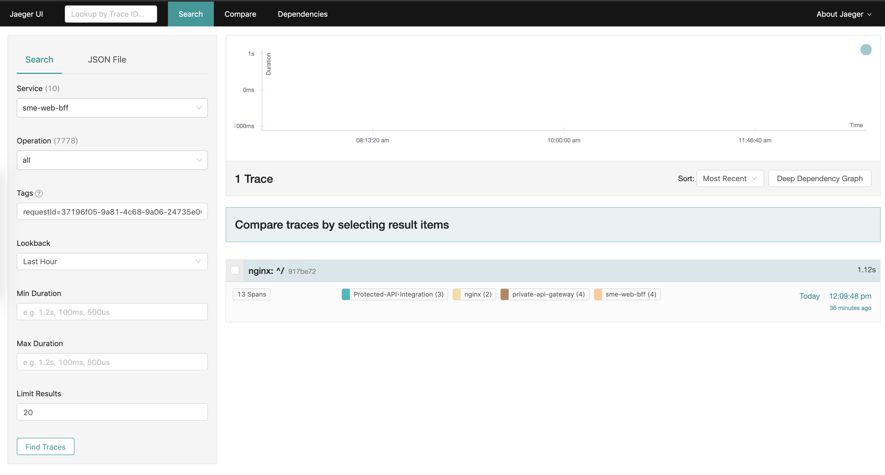
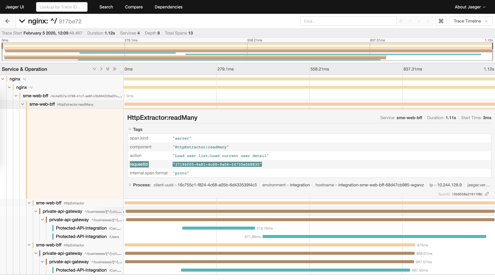

# Tracing a Request

Tracing can help us identify the service that has failed. This narrows the search for more information (i.e. logs).

We use [Jaeger](https://myobconfluence.atlassian.net/wiki/spaces/OBSERVE/pages/947357386/Tracing+-+Jaeger) to trace requests across services at MYOB. Services include anything that has been instrumented with tracing, e.g. the BFF, Private API Gateway, PAPI.

1. [Get the `x-myobapi-requestid`](getting-the-request-id.md)
1. Open up the Jaeger UI

    | Environment | URL |
    | --- | --- |
    | `preview` | https://jaeger.svc.europa.jupiter.myob.com/ |
    | `pdv` | https://jaeger.svc.europa-preprod.jupiter.myobdev.com/ |
    | `integration` | https://jaeger.svc.europa-preprod.jupiter.myobdev.com/ |
1. Search for the trace by the following fields

    | Field | Value |
    | --- | --- |
    | Service | `sme-web-bff` |
    | Operation | `all` |
    | Tags | `requestId=${YOUR_X_MYOBAPI_REQUESTID}` |
    
    
1. Inspect the trace

    

    * You should be able to identify which `service` has failed
