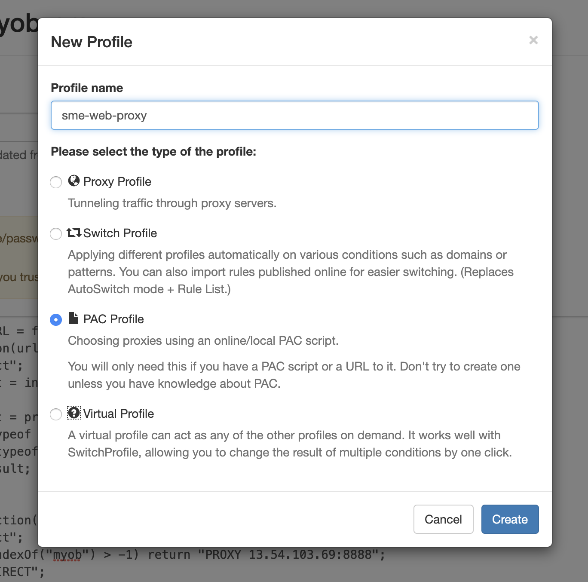
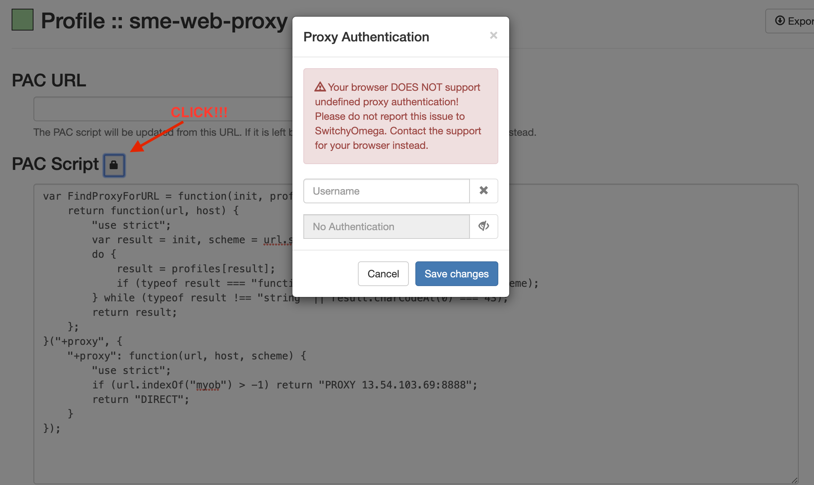

# Goal
To reduce the load on VPN

# Setup

1. Download chrome extension [`Proxy SwitchyOmega`](https://chrome.google.com/webstore/detail/proxy-switchyomega/padekgcemlokbadohgkifijomclgjgif)
2. Create new PAC profile:
    
3. Paste in script: 
    ```js
    var FindProxyForURL = function(init, profiles) {
        return function(url, host) {
            "use strict";
            var result = init, scheme = url.substr(0, url.indexOf(":"));
            do {
                result = profiles[result];
                if (typeof result === "function") result = result(url, host, scheme);
            } while (typeof result !== "string" || result.charCodeAt(0) === 43);
            return result;
        };
    }("+proxy", {
        "+proxy": function(url, host, scheme) {
            "use strict";
            if (url.indexOf("myob") > -1) return "PROXY 13.54.103.69:8888";
            return "DIRECT";
        }
    });

    ```
4. Enter password as so:
    
    You can find password in 1Password in the `sme` vault under the name [sme-web-proxy](https://myob.1password.com/vaults/x5c7bzdr3mvbh5jpz6ahdesw7u/allitems/fsnnxdlxfpwf5hwp5bfcfnt4sy)
5. Turn on proxy 🎉