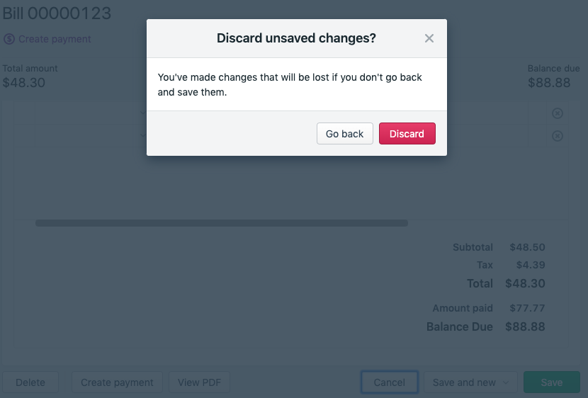

# Cancel Modal

When a user has made changes on a page, pressing cancel opens a modal to confirm they will lose their changes, otherwise we redirect away 💸. 



```js
// View

export const View = ({
  modalType,
  onCancel,
  onConfirmCancel,
  onCloseModal,
}) => (
  {modalType === ModalType.CANCEL ? (
    <CancelModal
      onCancel={onCloseModal}
      onConfirm={onConfirmCancel}
    />
  ) : null}

  <Button type="secondary" onClick={onCancel}>Cancel</Button> 
)
```

```js
// Module

const updateOption = ({ key, value }) => {
  this.dispatcher.updateOption({ key, value })
}

confirmCancel = () => {
  const state = this.store.getState();

  window.location.href = getRedirectUrl(state)
}

cancel = () => {
  const state = this.store.getState();
  const isPageEdited = getIsPageEdited(state);

  if (isPageEdited(state)) {
    this.dispatcher.openCancelModal();
  } else {
    this.confirmCancel()
  }
}

closeModal = () => {
  this.dispatcher.closeModal();
}

render = () => {
  return (
    <Provider store={this.store}>
      <View
        // ...
        onCancel={cancel}
        onConfirmCancle={confirmCancel}
      >
    </Provider>
  );
}
```

```js
// Selectors

const getIsPageEdited = state => state.isPageEdited;
const getRedirectUrl = createSelector(
  getRegion,
  getBusinessId,
  (region, businnessId) => `/#/${region}/${businessId}/shadowRealm`
)
```

```js
// Reducer

const getDefaultState = () => ({
  // ...
  isPageEdited: false,
  modalType: undefined,
})

const updateOption = (state, action) => ({
  ...state,
  isPageEdited: true,
});

const openCancelModal = (state, action) => ({
  ...state,
  modalType: ModalType.CANCEL,
})

const closeModal = (state, action) => ({
  ...state,
  modalType: undefined,
})
```
