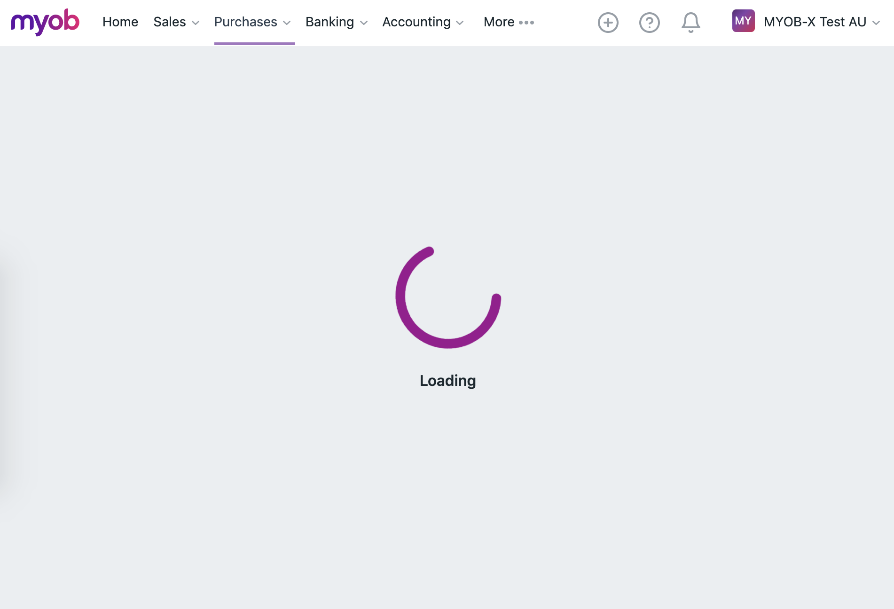
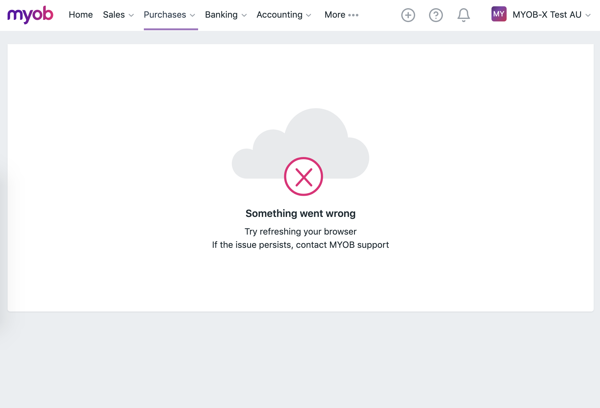

# Initial Page Load

The initial page load could either succeed or fail. We use the `<PageView>` component to handle these states.

| | |
| - | - |
Loading | 
Fail | 

```js
// Intent

const SET_LOADING_STATE = Symbol('Set loading state');
```

```js
// Reducer

const getDefaultState = () => ({
  // ...
  loadingState: LoadingState.LOADING,
})

const setLoadingPageState = (state, { loadingState }) => ({
  ...state,
  loadingState,
})
```

```js
// Dispatcher

const setLoadingPageState = loadingState => {
  store.dispatch({
    intent: SET_LOADING_STATE,
    loadingState,
  })
}
```

```js
// Selectors

const getLoadingState = state => state.loadingState
```

```js
// Module

const loadPage = () => {
  const onSuccess = (response) => {
    this.dispatcher.setLoadingState(LoadingState.LOADING_SUCCESS)
    // ..
  }

  const onFailure = () => {
    this.dispatcher.setLoadingState(LoadingState.LOADING_FAIL)
    // ..
  }

  this.dispatcher.setLoadingState(LoadingState.LOADING)

  this.loadPage({ onSuccess, onFailure })
}

const run = () => {
  // ..
  this.loadPage()
}
```

```js
// View

const View = ({
  // ...
  loadingState,
}) => {
  // ...
  const view = <MyView />

  return <PageView loadingState={loadingState} view={view}/>
}

const mapStateToProps = state => ({
  // ...
  loadingState: getLoadingState(state)
})
```
