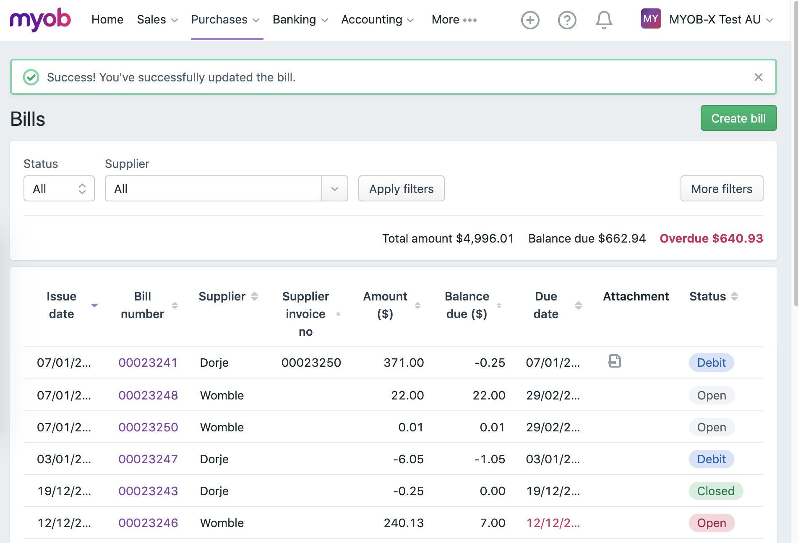

# Redirect alert

Often times, after performing an action on a page, we need to redirect to another page and show an alert.



We make use of the [`Inbox`](../../specifics/Inbox.md) to pass messages between modules.

```js
// Messages

const SUCCESSFULLY_SAVED = Symbol('Successfully saved');
```

```js
// Selectors

const getBusinessId = state => state.businessId;
const getRegion = state => state.region;

const getRedirectUrl = createSelector(
  getBusinessId,
  getRegion,
  (businessId, region) => `/#/${region}/${businessId}/bankingRule`
)
```

```js
// From Module

constructor({ pushMessage }) {
  this.pushMessage = pushMessage;
}

save = () => {
  onSuccess = ({ message }) => {
    // ...
    const state = this.store.getState();
    const redirectUrl = getRedirectUrl(state);

    this.pushMessage({
      type: SUCCESSFULLY_SAVED,
      content: message,
    })

    window.location.href = redirectUrl;
  }

  onFailure = () => {
    // ...
  }

  this.integrator.save({ onSuccess, onFailure })
}
```

```js
// To Module

constructor({ popMessages }) {
  this.popMessages = popMessages;
}

readMessages = () => {
  const [message] = this.popMessages([
    SUCCESSFULLY_SAVED
  ]);

  if (message) {
    this.dispatcher.setAlert({
      message: message.content
    })
  }
}

run = () => {
  // ...
  this.readMessages()
}
```
