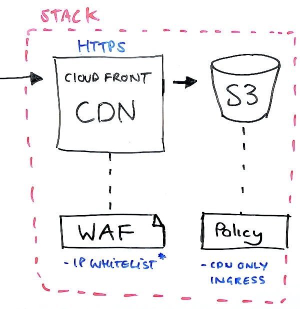

### Infrastructure for the Web UI

* [What do we have?](#what-do-we-have)
* [How do I deploy it?](#how-do-i-deploy)

### What do we have?

Currently we use the same Cloudformation stack for both internal and 'prod' environments as their requirements don't differ.
This is likely to change.

- CloudFront
    - A CDN that enables us to serve objects from a bucket over HTTPS.
    - Attatched to a Web Access Firewall (WAF) that only permits access from MYOB IPs.
- S3
    - Bucket holding the App.
    - No retention policy.
    - No backups.
    - Attatched to a Bucket Policy that only permits access from CloudFront nodes.

### How do I deploy?

Please see the [/aws/README] for detailed instructions.

[/aws/README]: https://github.com/MYOB-Technology/sme-web/aws/README.md
