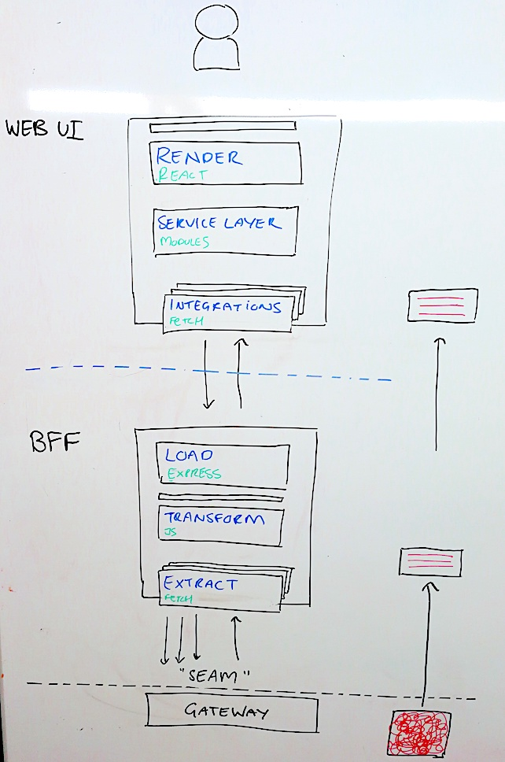
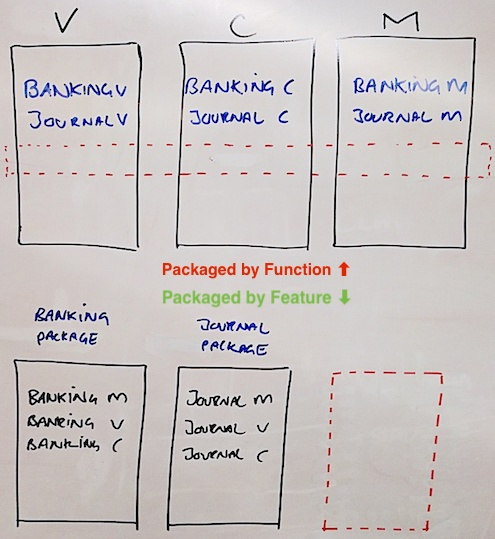

## Technical Overview

Both the Web UI & Web BFF are structured in a rough [ETL] shape.
Extract data, do Transformations on it, Load it somewhere else.
They each have some other minor collaborators or controls used to help them achieve tasks, but
at a top level these are the most fundamental building blocks of the apps.

### The Diagram

### Web UI

A publicly distributed Javascript bundle.

- Render (React)
    - How we paint results to the screen.
    - Lesser presentational Logic.
    - Largely composed of MYOB Feelix Widgets.
    - Knowledge of React Technology does not escape and bleed into other layers.

- Service Layer
    - Acts as a Control Plane.
    - We call Service Objects, 'Modules'. (ie: BankingModule)
    - As a consumer, I know 'what' i want, but not 'how' to get it.
      (eg. what: Banking Transactions, how: via a HTTP endpoint)
      The Service Layer enables this abstraction and provides a mechanism to keep consumers ignorant.

- Integrations
    - An integration is an implementation of a specific technology you can integrate with to resolve data, it is the 'how'.
    - Integrating with a remote HTTP data source means using a HTTP Integration, it is the only component knowledgable of HTTP and how it works.
    - Integrations are easily changed based on environment, we often use an InMemoryIntegration for local development.

### BFF

A Node process running Express. It turns complex responses from below the Seam into simple payloads for the Web UI.

- Load (Express)
    - The Webserver. Listen for web requests.
    - Uses the Express router to unpack a request and delegate action to a thin service control layer.

- Transform
    - Vanilla JS components that take big messy JSON in, and put clean smaller JSON out.
    - Strong test coverage and ripe for TDD.
    - The service layer may make use of multiple transformers to fulfil a request.

- Extract
    - Largely identical to the Integrations found in the Web UI.

### Design Philosophies

- We try to keep the Web UI thin, light and dumb. Its primary role is to render what it's given.
- The BFF belongs to the UI, it lives to serve.
    - The web should make as few calls as possible (ideally 1 per screen) to the BFF for its needs.
    - The contract between them is dictated by the UI and owned by us.
    - The values provided by the BFF are 'as needed' by the UI.
      The content provided by a BFF is 'display data' tailored to the client, ready to be rendered.
    - It's a Backend For (a) Frontend, not _many frontends_. Each BFF serves a single client. Here, we are the 'Web Client'.
- We try to push complexity down the stack, often below the 'Seam'.
    - We may be required to do non-trivial processing in the BFF at times.
    - Adhering to the design guidelines should make this work easy to 'push down' below the seam later, removing it from the BFF.
    - The BFF enables our team to work at a separate cadence from other 'downstream provider' teams.

### Vertical Domain Silos

- Our code is organised by Feature, not Function.
    - "Packaging stuff together by what it is, and not by what it does"
    - Conversely, you may be familiar with frameworks like Rails that require you to make a thin slice across the entire suit of packages to deliver a feature.
- We aim to be dry within a silo, but "wet" across them.
    - Don't rush to abstract and extract shared behaviours of Silos in an effort to be dry across them.
    - We favour the cost of duplication over the cost of the wrong abstraction.
    - Isolated packages means we can easily build and deploy product variants. ie: "Here's a build without Banking". Easy, just exclude the package.

- Delivering a new 'Screen' generally means creating a new package and adding each required component.
    - You can think of this as making a 'vertical slice' through both  our UI or BFF software.

[ETL]: https://en.wikipedia.org/wiki/Extract,_transform,_load
