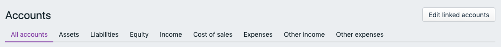
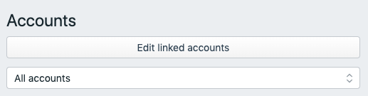
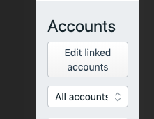

# Responsiveness

Feelix version: 5.7.0

## Expected behavior

Following behavior are expected as part of responsive design.  Wrappers of Feelix components or Feelix components have been created/pulled down to accomplish this vision.

### Tabs
Location: `./src/components/Tabs`

- Tabs should transform into select input on smaller screen size.

### Button
Location: `./src/components/Button`

- Button text should break to a new line if the text is longer than available screen.

### FilterBar
Location: `./src/components/Feelix/FilterBar`

- Filter panel `min-width` has been removed to allow smaller scale down
- Additional changes to `FilterBar`
  - Apply filter on pressing Enter key inside inputs
  - Close Filter panel on apply filter
