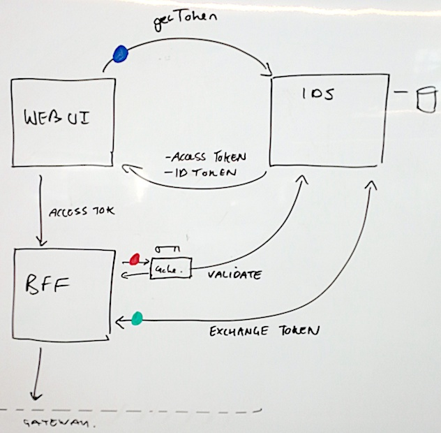
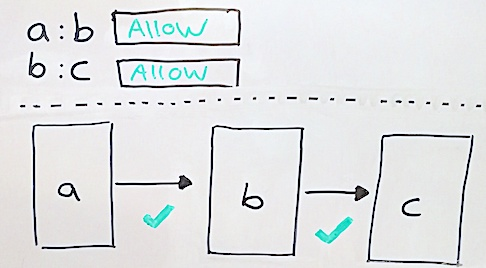

### Authentication

* [Authentication Flow](#authentication-flow-for-sme-web)
* [SDKs Used](#sdks-used)
* [IDS Admin Portal](#ids-admin-portal)

---

### Authentication Flow for SME Web

Users of the web client are required to login with our internal identity services.
Each service in our end-to-end systems chain is also required to register and validate each hop against those services.

1. Web UI asks IDS for an `Access Token`.
    1. Receives Access & ID Tokens.
2. Web UI passes `Access Token` via standard headers to the Web BFF.
3. Web BFF validates the token it has received.
4. Web BFF exchanges the token it received for a different token for the next hop.

### SDKs Used

The flow requires the use of 3 separate MYOB JavaScript SDKs.

- [IDAM JS Auth]
  Web UI **login** call, to get an access token.
- [IDAM Passport]
  BFF **validation** of incoming token using Asymmetric  Encryption.
     - Is this token for me?
     - Is this token authentic?
     - Is the scope of this token adequate?
- [IDAM NODE AUTH]
  BFF **exchange** of new token for next hop.

### IDS Admin Portal

:earth_asia: [IDS Admin Portal]

IDS Configuration is a whitelist of permitted service-to-service commincation.
Each entry defines a permitted hop between two parties, you can conceptualise a series of permitted sequential API calls like this:

[IDS Admin Portal - SIT]: https://sit-admin.account.myob.com
[IDS Admin Portal]: https://admin.account.myob.com
[IDAM JS Auth]: https://github.com/MYOB-Technology/idam-js-auth-sdk
[IDAM Passport]: https://github.com/MYOB-Technology/idam-passport-auth-sdk
[IDAM Node Auth]: https://github.com/MYOB-Technology/idam-node-auth-sdk

#### How to create new apps for UI & BFF

- Create apps (team lead)
  - sme-web: Public
  - sme-web-bff: Confidental

- sme-web:
  - set redirection endpoints (need to be `https`)

- sme-web-bff:
  - create credential (use this in the bff's env)
  - add permission: `user_impersonation`
  - add `sme-web` as `client` with `user_impersonation` delegated permissions
  - ask gateway to add `sme-web-bff` as their client
