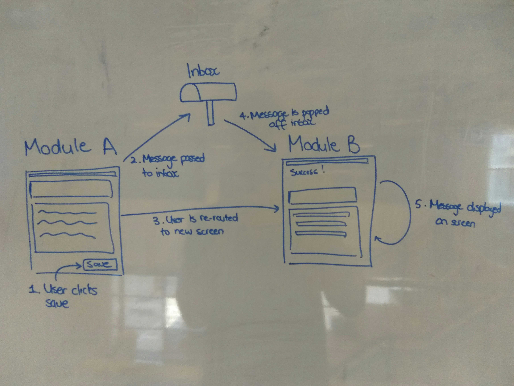

# Inbox

- [Inbox](#inbox)
  - [What is the inbox?](#what-is-the-inbox)
  - [Why was the inbox created?](#why-was-the-inbox-created)
  - [Did we consider the usage of query parameters?](#did-we-consider-the-usage-of-query-parameters)

---

## What is the inbox?

The inbox (`./src/Inbox.js`) is a stack that delivers messages from one module to another.

1. Module A pushes a message into the inbox after a user has triggered an action.
2. The URL is then changed.
3. This invokes Module B to begin running.
4. Module B will then pop from the inbox any messages based on an unique message type.

## Why was the inbox created?

The intention behind the _inbox_ was to allow modules to pass information from one to another. The development of the _inbox_ were based on the following assumptions/constraints:

- A module (e.g. Bills) would never run at the same time as another module (e.g. Invoice)
- A module could only communicate information to only one other module so as to remove any possibilities of unintended side effects *(See below for how)*
- To pass information, the recipient module would always have to run after the module sending information

Modules can not communicate beyond the next module - this was imposed by clearing out the inbox after each subsequent route change slightly after the next module begins running. This allows for a small window in which the newly run module can receive information. (See `afterAll()` in `Router.js`)

## Did we consider the usage of query parameters?

At the time, using query parameters was one of the solutions we had identified. However we had chosen not to use query parameters for the given reasons:
1. No clear contract between module A and module B i.e. lack of traceability
2. Difficult to pass complex data structures across

