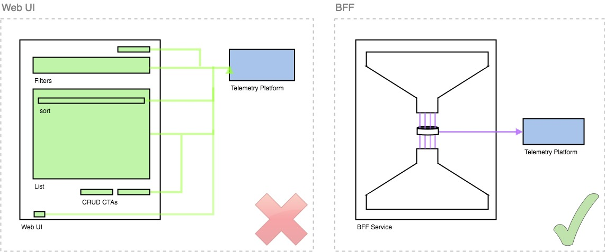

### Telemetry

* [Background](#background)
* [Implementation](#implementation-reference)
    - [Segment Environments]()
* [Working with Telemetry](#working-with-telemetry)
    - [Excluding a call from Telemetry Tracking](#excluding-a-call-from-telemetry-tracking)
    - [Censoring Query Paramters](#censoring-query-paramters)
---

### Background

[Solution Options Document](https://myobconfluence.atlassian.net/wiki/spaces/SA/pages/935604053/SLW+Telemetry+Solution+Options)

The [Telemetry Data Dictionary](https://myobconfluence.atlassian.net/wiki/spaces/ProdT/pages/240167622/Telemetry+Data+Dictionary) space for MYOB advises not to marry telemetry concerns to UI components.
The option we chose abides this advice. Therefor, the telemetry package is found over in the [BFF](https://github.com/MYOB-Technology/sme-web-bff/tree/master/src/telemetry).

You can find the initial Pull Request [here](https://github.com/MYOB-Technology/sme-web-bff/pull/221) that provides some background on the finer details of implementation options within the Express framework.



### Implementation Reference

Every inbound call to the BFF is captured in telemetry _by default_, including all the query parameters for each. Empty fields `(" ")` will be stripped out of the telemetry payload entirely.

Each Express Router instance used within the BFF is decorated with a `.all(*)` to capture all requests (GET, POST etc) and triggers a subsequent telemetry event (this excludes the OPTIONS requests).
This means we track the User's _intent_ of an action, and not whether it ultimately succeeded.

:warning:
- Some values for telemetry parse the URL recieved by the Router and so changes to our URL schema will impact telemetry.  
- The contextExtractionMiddleware pulls the `sub` value from the IDS JWT to use as a User identifier.

#### Segment Environments

We deploy the BFF as many differing stacks, but we only support 2 Segment Environments.

| Segment Staging  | Segment Production |
| ---------------- | ------------------ |
| Dev BFF          | Preview BFF        |
| Integration BFF  | Prod BFF           |
| PDV BFF          |                    |


### Working with Telemetry

#### Excluding a call from Telemetry Tracking

Add an entry to the [excludedPaths.js](https://github.com/MYOB-Technology/sme-web-bff/blob/master/src/telemetry/excludedPaths.js) blacklist.  
For Example, adding only `/calculate_totals` to this blacklist blocks the call for **all** modules.  
ie: 

```csv
spendMoney/calculate_totals,
receiveMoney/calculate_totals,
generalJournal/calculate_totals,
etc...
```

#### Censoring Query Paramters

You must exclude free text inputs from being captured by telemetry to prevent propagation of sensitive PII data.

For example, we do not track the content of the `Description` (keywords) filter, only whether it was used.

```js
const filterBarFields = req => ({
  ...req.query,
  keywords: undefinedOrBoolean(req.query.keywords),
});

```

If a particular field must be censored, you will need to contribute to the [getTelemetryFields](https://github.com/MYOB-Technology/sme-web-bff/blob/master/src/telemetry/getTelemetryFields.js) function.
